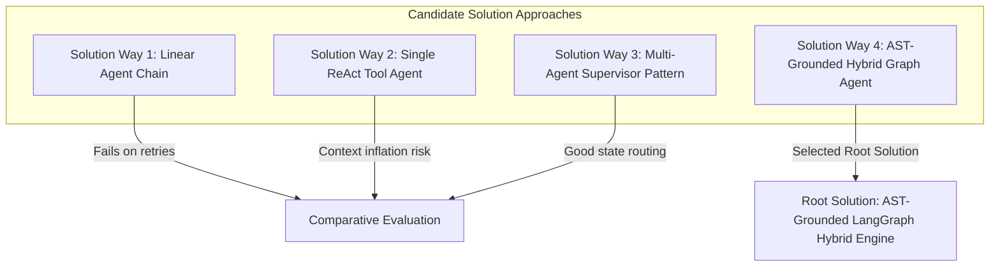

# SOP Code Generator: Detailed System Implementation Plan

## 1. Core Purpose and Processing Flow

The SOP Code Generator takes operational documentation and source code as input, processes them using static analysis and multi-agent reasoning, and outputs precise replacement code snippets to resolve reported incidents.

```text
  INPUTS                               INTERNAL PROCESSING                              OUTPUT
+-------------------+                +------------------------------------+           +-------------------------------+
| - Git Repo Link   |  ----------->  |  1. SOP Structured Extraction      | --------> | Replacement Code Snippet      |
| - SOP Document    |                |  2. Tree-sitter AST Graph Build    |           | (Target File + Fixed Snippet) |
+-------------------+                |  3. LangGraph Agent Patch Loop     |           +-------------------------------+
                                     |  4. Sandboxed Pytest Verification  |
                                     +------------------------------------+
```

---

## 2. Evaluation of Solution Approaches (Solution Ways)

To solve the problem statement effectively, four alternative solution approaches were evaluated during the research phase to establish the single optimal root solution.



### Detailed Solution Approach Comparison

| Solution Way | Architecture Strategy | Key Strengths | Critical Weaknesses | Trade-off Verdict |
| :--- | :--- | :--- | :--- | :--- |
| **Way 1: Linear Agent Chain** | Sequential DAG pipeline (`SOP` -> `Repo` -> `Coder` -> `Tester`). | Simple to build, predictable step ordering. | Cannot loop back when a patch fails tests; zero flexibility for complex SOPs. | Rejected: Inflexible for real-world debugging. |
| **Way 2: Single ReAct Tool Agent** | Single LLM equipped with `read_file`, `run_test`, `apply_diff` tools. | Flexible, fast prototype development. | High token bloat, tool hallucination, loses context on medium/large repositories. | Rejected: Unreliable on enterprise codebases. |
| **Way 3: Multi-Agent Supervisor** | LangGraph supervisor routing between specialized sub-agents. | Cycle-capable, handles retries cleanly, state isolated. | Lacks structural code dependency awareness if relying only on vector RAG. | Partially Adopted: Great routing, needs code graph. |
| **Way 4: AST-Grounded Hybrid Agent** *(Selected Root Solution)* | Combines **LangGraph Supervisor StateMachine** with **Tree-sitter + NetworkX AST Graph Retrieval**. | Binds context window to exact 2-hop symbol dependencies; verifies patches in sandbox with dynamic retries. | Requires Tree-sitter parsing overhead during intake. | **SELECTED ROOT SOLUTION**: Highest accuracy and structural safety. |

---

## 3. Phase-by-Phase Development Roadmap

```mermaid
flowchart TD
    subgraph Phase 1: Core Parsing & Graph Indexing
        P1_1[Tree-sitter AST Parser] --> P1_2[NetworkX Dependency Graph]
        P1_2 --> P1_3[Vector Store Indexer]
    end

    subgraph Phase 2: Agent Orchestration Engine
        P2_1[Pydantic State Schema] --> P2_2[SOP Analysis Agent]
        P2_2 --> P2_3[Supervisor LangGraph StateMachine]
        P2_3 --> P2_4[Patch & Coder Agent]
        P2_4 --> P2_5[Test & Evaluator Agent]
    end

    subgraph Phase 3: Backend API & Sandbox Runner
        P3_1[FastAPI Server Engine] --> P3_2[Background Job Queue]
        P3_2 --> P3_3[WebSocket Log Streamer]
        P3_3 --> P3_4[Git Commit & PR Handler]
    end

    subgraph Phase 4: Frontend Web Dashboard
        P4_1[Intake Form UI] --> P4_2[Live Agent Graph Renderer]
        P4_2 --> P4_3[Monaco Side-by-Side Diff Viewer]
        P4_3 --> P4_4[Live Terminal Log Stream]
    end

    Phase 1 --> Phase 2
    Phase 2 --> Phase 3
    Phase 3 --> Phase 4
```

---

## 4. Module Specifications & File Hierarchy

### 4.1 Module Breakdown Table

| Module Layer | Primary Responsibility | Key Files | Technologies |
| :--- | :--- | :--- | :--- |
| **AST & Graph Indexer** | Parses codebase into abstract syntax trees and dependency graphs | `graph/tree_sitter_parser.py`<br>`graph/code_graph.py` | Tree-sitter, NetworkX |
| **RAG & Vector Retrieval** | Indexes code snippets and SOP rules for hybrid vector search | `rag/embeddings.py`<br>`rag/vectorstore.py`<br>`rag/retriever.py` | SentenceTransformers, Qdrant |
| **Multi-Agent Core** | Orchestrates SOP parsing, planning, patch generation, and evaluation | `agents/state.py`<br>`agents/supervisor.py`<br>`agents/sop_agent.py`<br>`agents/patch_agent.py`<br>`agents/testing_agent.py`<br>`agents/evaluator_agent.py` | LangGraph, LangChain, Pydantic |
| **Backend REST & WS API** | Handles asynchronous incident execution and WebSocket state streaming | `backend/app.py`<br>`backend/jobs.py`<br>`backend/sandbox.py` | FastAPI, Uvicorn, Asyncio |
| **Frontend Web Dashboard** | Web interface for incident entry, agent graph visualization, and diff review | `frontend/index.html`<br>`frontend/js/app.js`<br>`frontend/js/websocket.js`<br>`frontend/js/diff_viewer.js` | HTML, Vanilla CSS, JS, Monaco Editor |

---

## 5. Comprehensive File Implementation Details

### Phase 1: Core Engine & Graph Parsing

#### 1. `graph/tree_sitter_parser.py`
- Extract symbols (functions, methods, classes, imports) from Python source files using Tree-sitter.
- Inputs: Source code file path or raw string.
- Outputs: List of parsed `SymbolNode` objects containing line numbers, signature, docstring, and code body.

#### 2. `graph/code_graph.py`
- Build an in-memory `NetworkX.DiGraph` representing the repository.
- Edges created: `IMPORTS`, `CALLS`, `INHERITS_FROM`, `DEFINED_IN`.
- Inputs: Directory path to cloned repository.
- Outputs: Queryable code graph for 2-hop neighborhood retrieval.

---

### Phase 2: Multi-Agent Engine (LangGraph)

#### 3. `agents/state.py`
- Define `SOPGeneratorState` Pydantic model:
  ```python
  class SOPGeneratorState(TypedDict):
      repo_path: str
      sop_raw_text: str
      sop_structured: dict
      ast_graph: dict
      current_plan: list[str]
      patch_diff: str
      test_logs: str
      retry_count: int
      status: str
  ```

#### 4. `agents/sop_agent.py`
- Parse unstructured SOP document into Pydantic structured tasks (Target Files, Error Signature, Steps to Fix, Verification Checks).

#### 5. `agents/patch_agent.py`
- Generate unified file diffs and replacement code snippets grounded in the target file AST context.

#### 6. `agents/testing_agent.py`
- Execute pytest / unit test commands inside a sandboxed subprocess and return formatted exit code and log output.

#### 7. `agents/evaluator_agent.py`
- Validate test execution logs and verify SOP requirements compliance.

#### 8. `agents/supervisor.py`
- Construct LangGraph `StateGraph` linking nodes (`sop_agent`, `git_agent`, `planner`, `patch_agent`, `test_agent`, `evaluator`).
- Enforce recursion ceiling (`max_retries = 5`) to prevent infinite repair loops.

---

### Phase 3: Backend API Server

#### 9. `backend/app.py`
- `POST /api/v1/incidents`: Enqueue incident job, return `incident_id`.
- `GET /api/v1/incidents/{id}`: Return incident status, patches, and diff data.
- `POST /api/v1/incidents/{id}/apply`: Commit fix and create Git Pull Request.
- `WS /ws/incidents/{id}`: Stream real-time node transitions, log lines, and diff updates.

#### 10. `backend/sandbox.py`
- Create isolated temporary directories for cloning repositories, running tree-sitter, and executing unit tests safely.

---

### Phase 4: Frontend Web Interface

#### 11. `frontend/index.html` & `frontend/js/`
- Render clean dark-mode dashboard with:
  1. Incident Intake Panel (Repo URL + SOP Upload).
  2. Live Agent Node Flow Visualizer.
  3. Monaco Split-Screen Diff Viewer.
  4. Embedded Streaming Terminal.

---

## 6. Verification Plan and Test Strategy

### Automated Unit and Integration Tests
- **AST Graph Parsing**: Test symbol extraction accuracy on sample Python code in `tests/test_code_graph.py`.
- **SOP Structuring**: Test Pydantic schema extraction on mock SOP documents in `tests/test_sop_agent.py`.
- **Patch Application**: Test unified diff application and AST replacement in `tests/test_patch_agent.py`.
- **Backend API**: Test endpoints and WebSocket connections in `tests/test_api.py`.

### End-to-End Verification Test
Run full workflow test using a sample bug repository and corresponding SOP document:
```bash
python cli.py --repo data/codebase/sample_repo --sop data/sops/sample_sop.md
```
Verify that:
1. Target file `db/connection_pool.py` is correctly identified.
2. Code snippet replacement is accurately generated.
3. Pytest passes in the sandbox environment.
