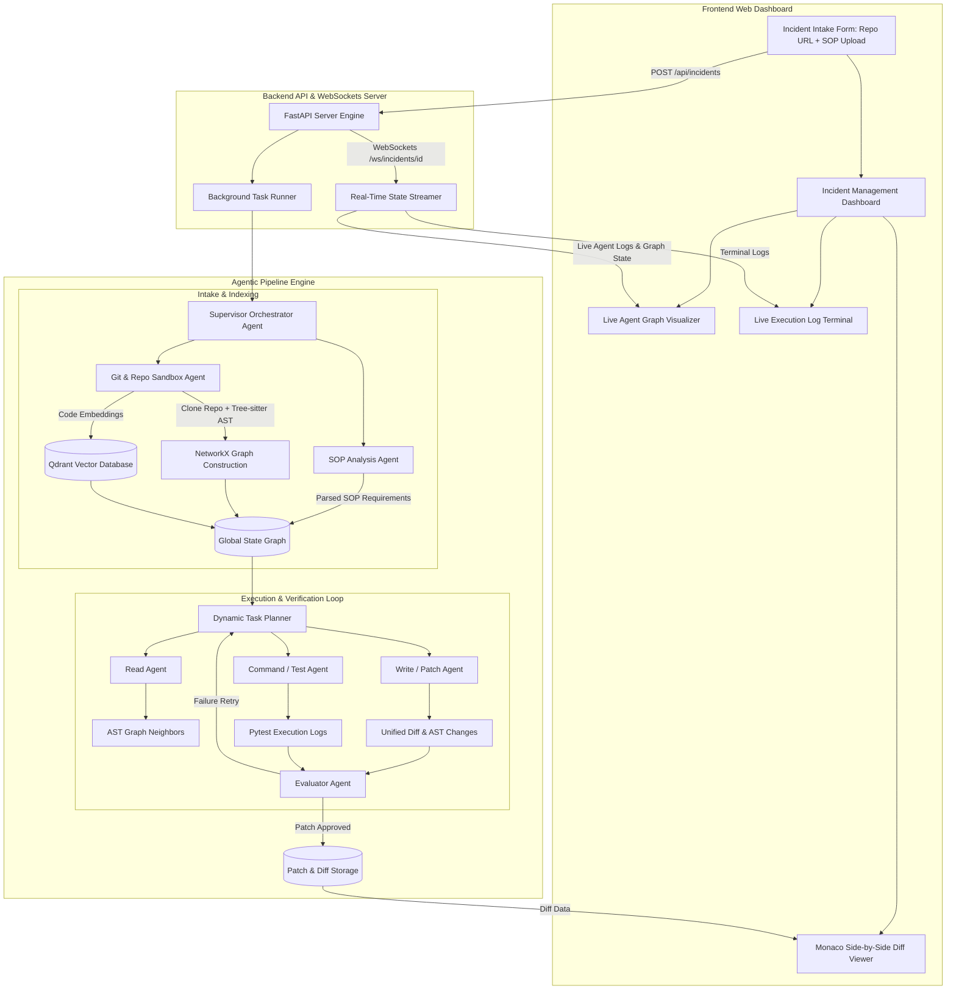
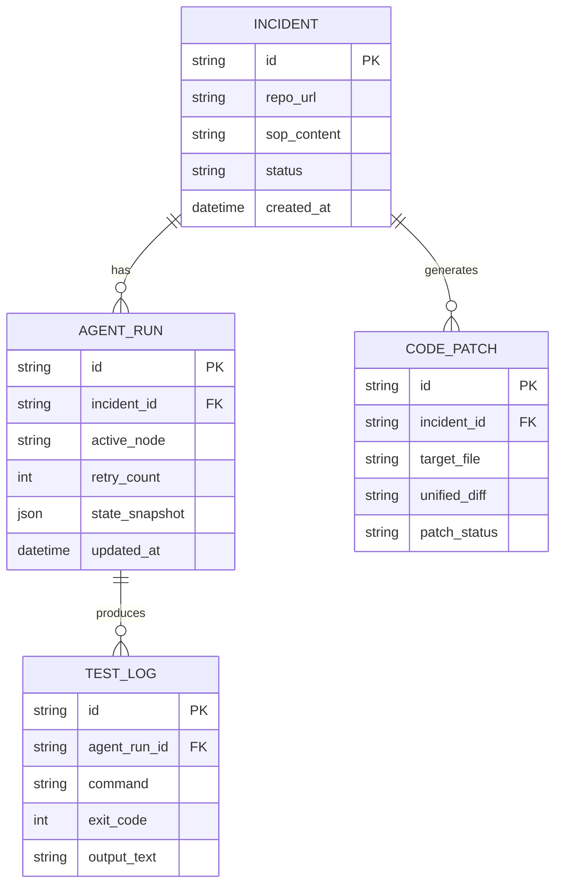

# Comprehensive Feasibility, Doability, and Full-Stack System Architecture: SOP Code Generator

## 1. Executive Summary and System Vision

The primary objective of the SOP Code Generator is to automate software debugging and patching by pairing human-written Standard Operating Procedure (SOP) documents with autonomous multi-agent code modification workflows. 

When an operational incident occurs, engineers follow an SOP that outlines error diagnostics, affected components, and step-by-step remediation procedures written in natural language. The proposed system ingests both the target codebase repository and the corresponding SOP document, parses code relationships into an Abstract Syntax Tree (AST) knowledge graph, formulates an execution plan, applies verified code patches inside an isolated sandbox environment, and exposes a modern full-stack web dashboard for real-time visual monitoring, patch verification, and git management.

### Summary Verdict on Doability

Building a full-fledged SOP-to-code generation platform with a frontend dashboard and backend agent orchestration server is **technically feasible** and highly practical. Success depends on a **hybrid architecture**: combining deterministic static code analysis (Tree-sitter + NetworkX) with stochastic LLM agent orchestration (LangGraph), served through a responsive FastAPI backend and a real-time web dashboard.

---

## 2. End-to-End Full-Stack System Architecture



---

## 3. Full-Stack Functional Workflow Decomposition

### 3.1 Frontend Web Application Architecture

The frontend provides an interactive environment designed for incident response engineers. It replaces black-box AI code generation with complete transparency, real-time progress visualization, and side-by-side patch editing.

#### Core Frontend Modules & Views
1. **Incident Intake Workspace**:
   - Repository URL input (GitHub, GitLab, or local directory path).
   - SOP Document dropzone (supports Markdown `.md`, PDF, or raw text paste).
   - Target branch selection and environment variable input options.

2. **Real-Time Agent Execution Graph Visualizer**:
   - Interactive visual node graph displaying current agent states (`SOP Parser` -> `Repo Indexer` -> `Planner` -> `Coder` -> `Tester` -> `Evaluator`).
   - Active node highlights, execution timers, and step-by-step progress metrics.

3. **Live Execution Log Terminal**:
   - Embedded streaming terminal displaying shell commands, `pytest` output, AST graph node traversals, and sandbox logs in real-time.

4. **Monaco Side-by-Side Patch Reviewer**:
   - Split-screen code editor showing original vs patched file content.
   - Interactive line diffs, syntax highlighting, and manual tweak capabilities before applying changes.
   - One-click **Apply Patch**, **Export PR**, or **Re-run Agent** action buttons.

```text
+-----------------------------------------------------------------------------------+
|  SOP CODE GENERATOR DASHBOARD                                  Incident #INC-4028 |
+------------------------------------+----------------------------------------------+
| INTAKE FORM                        | LIVE AGENT GRAPH WORKFLOW                    |
| Git Repo: github.com/org/service   | [SOP Parse] -> [AST Graph] -> (PLANNER)      |
| SOP File: connection_fix.md        |                                  |           |
| Branch: main                       |                           [PATCH CODER]      |
| [START RESOLUTION]                 |                                  |           |
|                                    |                           [TEST RUNNER]      |
+------------------------------------+----------------------------------------------+
| LIVE TERMINAL LOGS                 | MONACO SIDE-BY-SIDE DIFF VIEWER              |
| > Cloning repository into sandbox  | File: db/connection_pool.py                  |
| > Tree-sitter indexed 142 files    | - self.max_overflow = 5                      |
| > Pytest executed: 12 passed       | + self.max_overflow = 20                     |
| > Evaluator status: PASS           | + self.retry_backoff = True                  |
+------------------------------------+----------------------------------------------+
```

---

### 3.2 Backend Server & API Specification

The backend server is powered by FastAPI, providing RESTful control endpoints alongside a WebSocket streaming architecture for real-time agent observability.

#### Backend Module Structure
1. **API Router (`app.py`)**:
   - `POST /api/v1/incidents`: Submits a new incident job with Git URL and SOP content.
   - `GET /api/v1/incidents/{id}`: Fetches status, generated diffs, and evaluation metrics.
   - `POST /api/v1/incidents/{id}/apply`: Triggers git commit/push or PR creation for approved patches.
   - `WS /ws/incidents/{id}`: Bi-directional WebSocket connection for streaming logs, state transitions, and diff generation updates.

2. **Job Orchestrator (`jobs.py`)**:
   - Manages asynchronous background tasks for long-running multi-agent resolution loops.
   - Updates local SQLite/PostgreSQL metadata store and broadcasts state changes to connected WebSocket clients.

3. **Sandbox Execution Manager (`sandbox.py`)**:
   - Provisions isolated temporary directory environments.
   - Handles secure subprocess execution for `git clone`, `tree-sitter` indexing, `pytest` test runs, and patch verification.

---

## 4. Deep Feasibility and Doability Matrix

| Component Layer | Technical Stack | Feasibility | Complexity | Key Technical Challenge | Mitigation Strategy |
| :--- | :--- | :--- | :--- | :--- | :--- |
| **Frontend UI** | HTML / JS / Vanilla CSS / Monaco Editor | High (95%) | Medium | Rendering side-by-side git diffs with real-time WebSocket state updates smoothly. | Use Monaco Editor diff model combined with lightweight WebSocket event handler. |
| **Backend REST & WS** | FastAPI / Uvicorn / Asyncio | High (95%) | Low | Managing concurrent incident background execution jobs without blocking event loop. | Run heavy agent graph processing inside asynchronous background tasks. |
| **SOP Parsing** | LangChain / Pydantic / LLM | High (90%) | Medium | Handling unstructured, incomplete, or ambiguous SOP documentation. | Enforce rigid Pydantic schemas with fallback prompt disambiguation. |
| **AST Code Graph** | Tree-sitter / NetworkX | High (95%) | High | Memory footprint and index time on large repositories. | Implement lazy incremental parsing and filter out non-code assets (`.gitignore`). |
| **Agent State Routing** | LangGraph StateGraph | High (90%) | High | Preventing infinite repair loops when test fixes fail continuously. | Enforce maximum retry budgets and state diff history tracking. |
| **Sandboxed Execution** | Subprocess Isolation / Pytest | High (95%) | Medium | Handling malicious or runaway shell commands during testing. | Enforce shell command allowlists, timeout caps (30s), and path restricted sub-shells. |

---

## 5. Database Schema & Data Models

### Database Entity Relationship Diagram



---

## 6. End-to-End Real-Time WebSocket Communication Protocol

### WebSocket Event Stream Payload Definitions

#### 1. Node Transition Event (`AGENT_NODE_CHANGE`)
```json
{
  "event": "AGENT_NODE_CHANGE",
  "incident_id": "inc_9012",
  "timestamp": "2026-08-18T21:54:00Z",
  "data": {
    "previous_node": "git_indexer",
    "current_node": "planner_agent",
    "progress_percent": 35
  }
}
```

#### 2. Terminal Output Stream Event (`TERMINAL_LOG`)
```json
{
  "event": "TERMINAL_LOG",
  "incident_id": "inc_9012",
  "timestamp": "2026-08-18T21:54:05Z",
  "data": {
    "stream": "stdout",
    "line": "pytest tests/test_pool.py: 12 passed in 1.42s"
  }
}
```

#### 3. Patch Generated Event (`PATCH_GENERATED`)
```json
{
  "event": "PATCH_GENERATED",
  "incident_id": "inc_9012",
  "timestamp": "2026-08-18T21:54:12Z",
  "data": {
    "file": "db/connection_pool.py",
    "diff": "--- a/db/connection_pool.py\n+++ b/db/connection_pool.py\n@@ -10,3 +10,3 @@\n- max_overflow = 5\n+ max_overflow = 20\n",
    "evaluator_status": "PASS"
  }
}
```

---

## 7. Concrete Project Structure (Full-Stack Engine)

```text
sop-code-generator/
├── frontend/                 # Web Dashboard Interface
│   ├── index.html            # Single page app layout & Monaco mounts
│   ├── css/
│   │   └── style.css         # Modern dark-mode styling & dynamic grid
│   └── js/
│       ├── app.js            # Main dashboard controller & REST caller
│       ├── websocket.js      # WebSocket log & state streaming client
│       ├── graph_view.js     # Agent workflow visualization renderer
│       └── diff_viewer.js    # Monaco diff editor integration
│
├── backend/                  # FastAPI Backend API Server
│   ├── app.py                # REST routers & WebSocket endpoints
│   ├── jobs.py               # Async background job runner
│   ├── models.py             # Pydantic & SQLAlchemy data schemas
│   └── sandbox.py            # Isolated git clone & shell execution engine
│
├── agents/                   # LangGraph Multi-Agent Engine
│   ├── state.py              # Central agent state schema
│   ├── supervisor.py         # StateGraph router & conditional edges
│   ├── sop_agent.py          # SOP natural language parser
│   ├── git_agent.py          # Repository cloner & AST indexer
│   ├── planner_agent.py      # Execution task planner
│   ├── patch_agent.py        # Code patch generator (Diff & AST replace)
│   ├── testing_agent.py      # Pytest command execution agent
│   └── evaluator_agent.py    # Quality validator (DeepEval/RAGAS)
│
├── graph/                    # Code AST Knowledge Graph
│   ├── tree_sitter_parser.py # Tree-sitter multi-language AST parser
│   └── code_graph.py         # NetworkX call dependency graph builder
│
├── rag/                      # RAG Indexing & Storage
│   ├── embeddings.py         # Vector embedding pipeline
│   ├── vectorstore.py        # Qdrant vector database interface
│   └── retriever.py          # Hybrid AST + Vector retriever
│
├── research/
│   ├── Day1_Research.md      # Initial outline
│   └── Ag-research.md        # Complete feasibility & full-stack architecture
│
├── tests/                    # System & Component Tests
│   ├── test_api.py           # Backend API integration tests
│   ├── test_code_graph.py    # AST graph construction unit tests
│   └── test_patch_agent.py   # Patch application unit tests
│
├── requirements.txt          # Python dependency manifest
└── README.md                 # System overview and setup guide
```

---

## 8. Final Verdict on Full-Stack Solution

Building a full-fledged functional web platform with an interactive frontend, FastAPI backend, and LangGraph agent workflow is **100% achievable and highly practical**.

- The **frontend dashboard** transforms complex multi-agent execution into a transparent, visual experience where engineers can inspect live terminal output, monitor agent nodes, and review code diffs in Monaco editor before accepting changes.
- The **backend engine** cleanly separates async job queuing from long-running agent workflows, ensuring real-time WebSocket state streaming without blocking API performance.
- The **hybrid AST agent core** ensures code patches are grounded in actual codebase structure, avoiding hallucinations and token limits.
